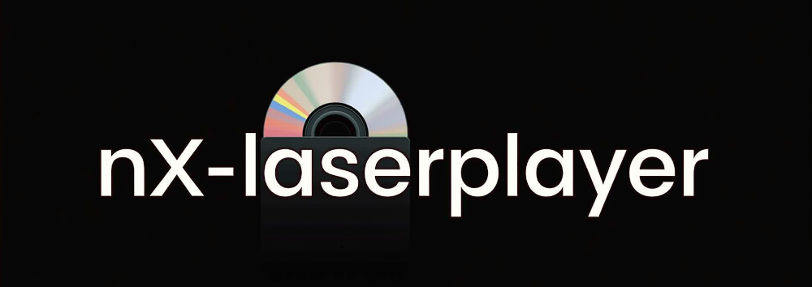

# nx-laserplayer

Nintendo Switch Video Player for Optical Disc (CD/DVD/BD)

The two mayor protection systems are implemented in this way

- CSS is managed by libusbdvd so all DVD are are recognized as unprotected disc
- AACSv1 is managed by the player itself using libbluray libaacs and mbedtls (need a keyfile just like VLC)

ONLY H264 Bluray disc are supported since Switch dont have an hw decoder for VC1
Blu-ray ULTRA (4k) are NOT supported

For AACS Decoding 

-   search online for "**keydb blu ray**" → you should find "**keydb_eng.zip**" (~20MB) or similar (keydb_fra.zip, keydb_ita.zip, keydb_deu.zip, etc.)
-   open keydb_eng.zip and decompress it to  **/switch/nx-laserplayer**  on your microSD card
-   you should now have (next to nx-laserplayer.nro)  **sdmc:/switch/nx-laserplayer/KEYDB.cfg**  (~60MB). Warning ! this file is CASE SENSITIVE : KEYDB must be uppercase, .cfg must be lowercase)
-   AACS is now enabled on nx-laserplayer

Thanks to [libusbdvd](https://github.com/proconsule/libusbdvd) it features:

 - DVD Video playback (supporting Commercial DVD-Video)
 - Blu-ray playback (supporting Commercial Bluray with AACSv1, Bluray Ultra with AACSv2 are not supported)
 - SVCD playback
 - VCD playback

Thanks to averne [mpv](https://github.com/averne/mpv) it features:

 - MPEG2 HW Decoder
 - H264 HW Decoder
 - H265 HW Decoder (with HDR support)

You need an external optical drive connected via USB to the Switch, a dock with good power supply is needed since usb optical drives have high power spikes

For Blu-ray decoding thanks to

https://images.videolan.org/developers/libbluray.html
https://images.videolan.org/developers/libaacs.html